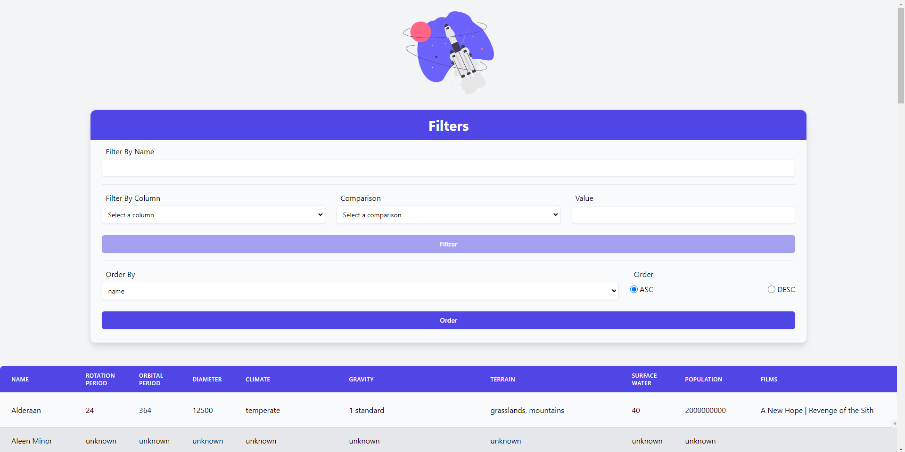

<h1 align="center">StarWars Planets Search</h1>

Link para a aplicação: https://pauloedsg.com/recipes-app/

Projeto consistia em fazer uma aplicação em React de um App onde você pode consultar e filtrar por planetas do universo StarWars.

## Aprendizados
 * Tailwind
 * Hooks
 * Context API

<h2 align="center">Como rodar o projeto</h2>

### No terminal
1. Clonar o projeto `git clone git@github.com:pauloeduardods/StarwarsPlanetsSearch.git`
2. Entrar no diretório `cd StarwarsPlanetsSearch`
3. Instalar as dependências `npm install`
4. Rodar a aplicação `npm start`
5. Acessar a aplicação `http://localhost:3000`

## Tecnologias
* React
* TailWindCSS
* Context Api
* Hooks

## Status

Finalizado
